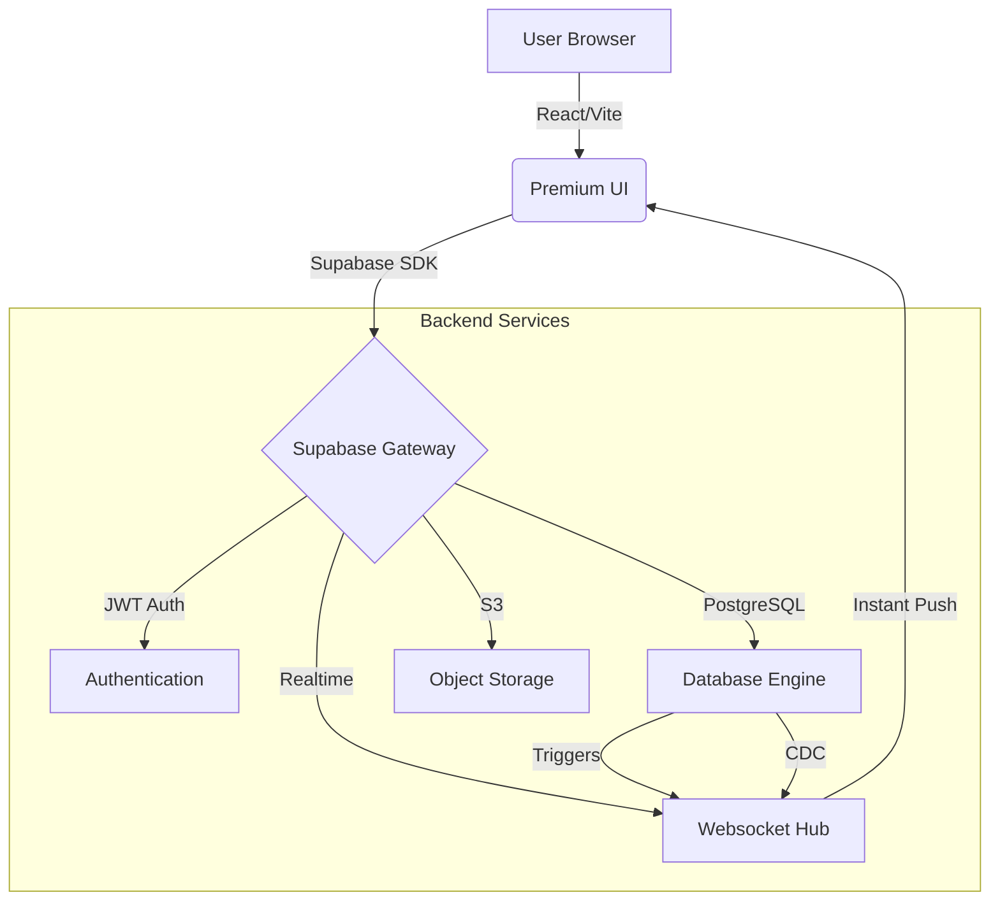
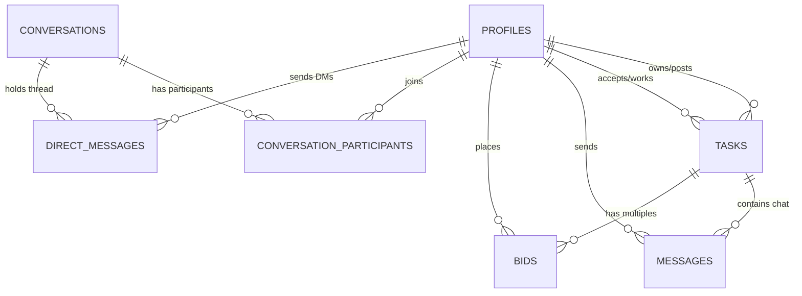
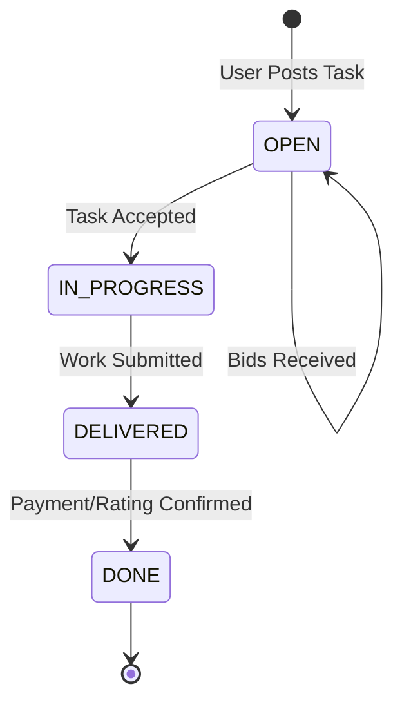

# 🚀 NastyTask Done


**NastyTask Done** is a premium, real-time academic task marketplace. Designed with a focus on speed, security, and user experience, it serves as a bridge between students and experts.

---

## 🛠 Tech Stack

| Component | Technology | Role |
| :--- | :--- | :--- |
| **Frontend** | React 18 + TypeScript | UI Logic & Componentization |
| **Build Tool** | Vite | Ultra-fast Development & Bundling |
| **Styling** | Tailwind CSS | Utility-first, Responsive Design |
| **Icons** | Lucide React | Clean, Modern Vector Icons |
| **Backend** | Supabase | Auth, Database, Storage, & Realtime |
| **Database** | PostgreSQL | Relational Data Modeling |

---

## ✨ Premium Features

- **⚡ Instant Messaging**: A WhatsApp-like experience with real-time delivery, typing indicators, and read receipts.
- **🎨 Glassmorphism UI**: A stunning, modern interface with smooth transitions, gradients, and full dark mode support.
- **🛡️ Iron-clad Security**: Row Level Security (RLS) ensures that only authorized users can access or modify their own data.
- **📢 Real-time Feed**: Tasks appear on the dashboard the moment they are posted—no refresh needed.
- **🤖 Auto-Profiling**: Instant profile setup for Google & OAuth users with intelligent name extraction.
- **📈 Reputation System**: Peer-to-peer rating and verification system to build trust within the community.

---

## 🏗 System Architecture



---

## 📊 Database Relationship Diagram



---

## � Task Lifecycle



---

## 📁 Project Structure

```text
nasty-task/
├── src/
│   ├── components/      # Reusable UI & Logical components
│   │   ├── auth/        # Login/Signup logic
│   │   ├── layout/      # Sidebar & Navigation
│   │   ├── messages/    # Real-time chat UI
│   │   ├── profile/     # User settings & stats
│   │   └── tasks/       # Task feed & detail cards
│   ├── hooks/           # Custom React hooks (useAuth, useChat, etc.)
│   ├── lib/             # Supabase client & types
│   └── App.tsx          # Main entry point & Routing
├── supabase/
│   └── migrations/      # PostgreSQL schema & RLS policies
└── tailwind.config.js   # Custom theme & Glassmorphism settings
```

---

## 🚀 Getting Started

### 1. Prerequisites
- [Node.js](https://nodejs.org/) (v18+)
- [Supabase CLI](https://supabase.com/docs/guides/cli) (optional, for DB pushes)

### 2. Installation
```bash
git clone https://github.com/thelost-beep/nasty-task.git
cd nasty-task
npm install
```

### 3. Environment Config
Rename `.env.example` to `.env` or create a new one:
```env
VITE_SUPABASE_URL=your_project_url
VITE_SUPABASE_ANON_KEY=your_anon_key
```

### 4. Running the App
```bash
npm run dev
```

---

## 🛡 Security & RLS Policies

NastyTask uses **Row Level Security (RLS)** to protect user data at the database level:

| Table | Policy | Scope |
| :--- | :--- | :--- |
| `profiles` | `Anyone can read active` | Public |
| `profiles` | `Users can update own` | Owner |
| `tasks` | `Authenticated can read all` | Authenticated |
| `messages` | `Participants only` | Task Members |
| `notifications` | `Own notifications only` | Recipient |

---

## 🤝 Contributing
Contributions are welcome! Please feel free to submit a Pull Request.

---

**Developed with ❤️ by the NastyTask Team.**  
 -**Aftab Alam**
