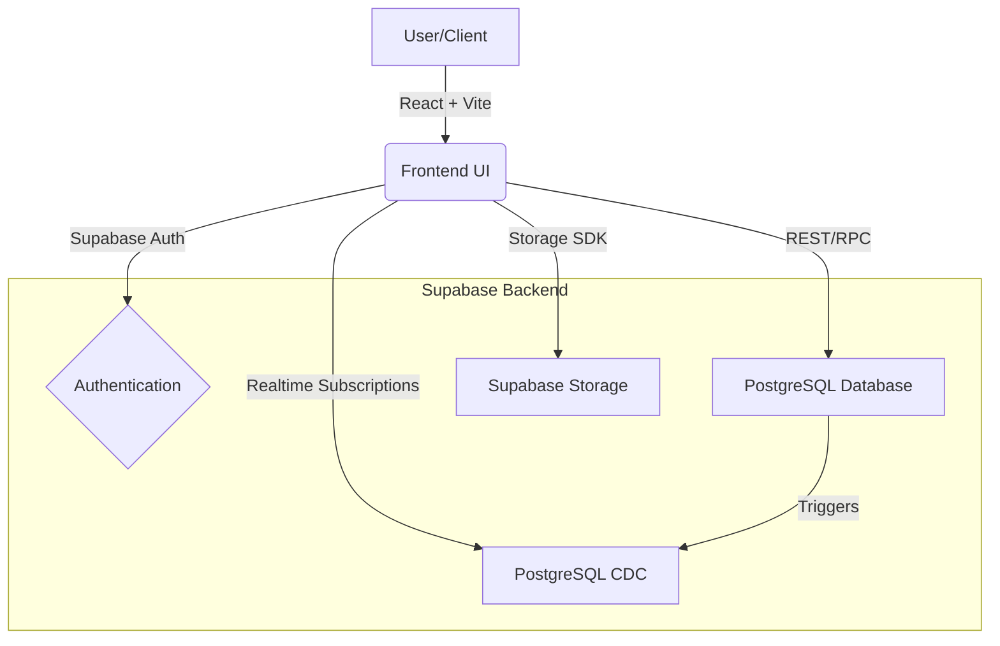
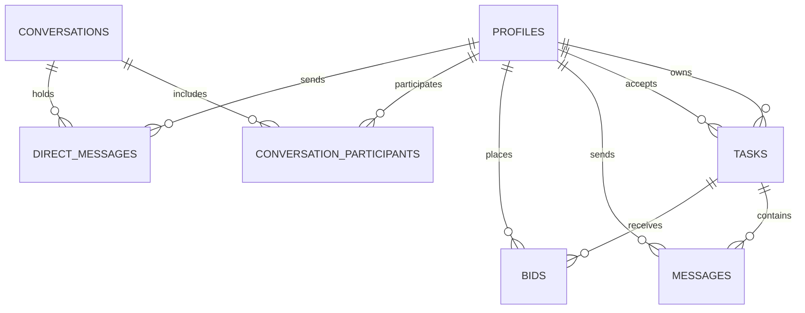
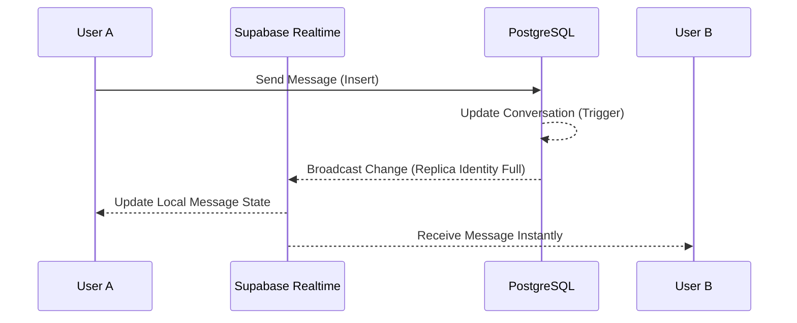

# 🚀 NastyTask Done

**NastyTask Done** is a premium, real-time academic task marketplace designed for seamless collaboration. Whether you need help with an assignment or want to earn by sharing your expertise, NastyTask provides a secure and fast platform with a state-of-the-art chatting system.

---

## 🛠 Tech Stack

| Component | Technology |
| :--- | :--- |
| **Frontend** | React, TypeScript, Vite |
| **Styling** | Tailwind CSS, Lucide Icons |
| **Backend** | Supabase (Auth, DB, Realtime, Storage) |
| **Database** | PostgreSQL |
| **Realtime** | PostgreSQL CDC (Change Data Capture) |

---

## ✨ Features

- **Real-time Messaging**: WhatsApp-like speed with instant delivery and read status.
- **Task Marketplace**: Browse, post, and accept tasks with a unified bidding system.
- **Secure Profiles**: Automatic profile creation from Google/OAuth with reputation tracking.
- **Interactive Board**: Real-time task feed updates.
- **Dark Mode**: Premium glassmorphism UI with full theme support.
- **Notifications**: Instant alerts for task acceptance, bids, and messages.

---

## 🏗 System Architecture



---

## 📊 Database Schema



---

## 💬 Real-time Messaging Flow



---

## 🚀 Getting Started

### 1. Prerequisites
- Node.js (v18+)
- Supabase Account

### 2. Installation
```bash
# Clone the repository
git clone https://github.com/thelost-beep/nasty-task.git

# Install dependencies
npm install
```

### 3. Environment Setup
Create a `.env` file in the root:
```env
VITE_SUPABASE_URL=your_supabase_url
VITE_SUPABASE_ANON_KEY=your_supabase_anon_key
```

### 4. Running Locally
```bash
npm run dev
```

### 5. Database Setup
The migrations are located in `supabase/migrations/`. You can push them using the Supabase CLI:
```bash
supabase db push
```

---

## 🛡 License
Distributed under the MIT License. See `LICENSE` for more information.

---

**Developed with ❤️ for Advanced Agentic Coding.**
